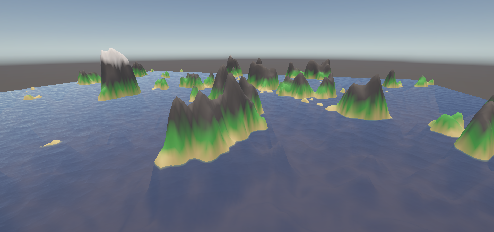
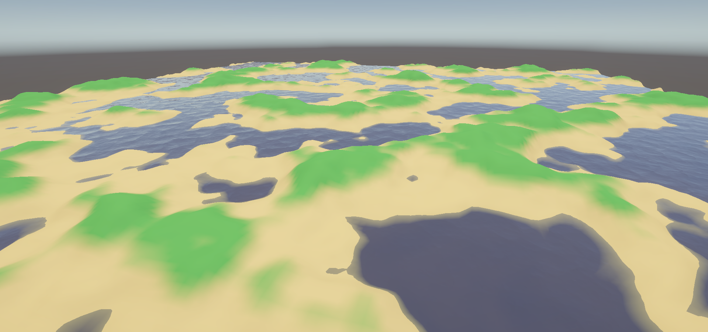
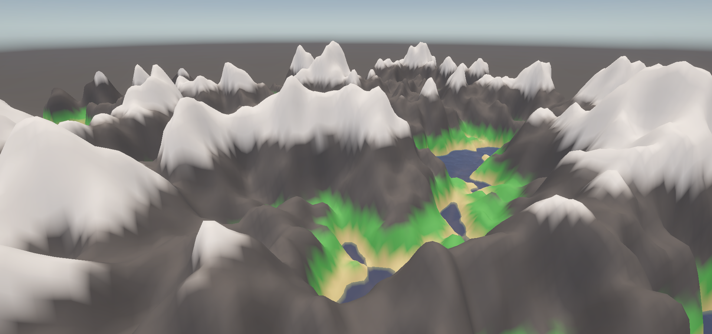
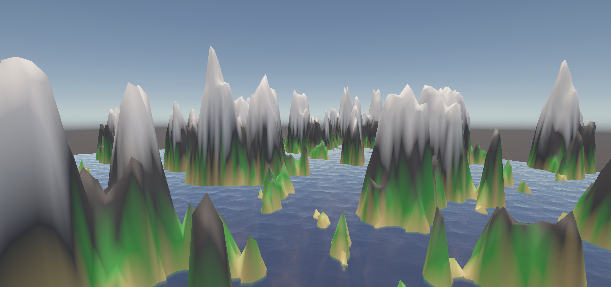
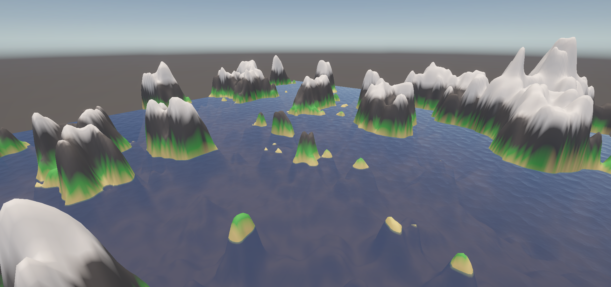

# Procedural Content Generation

Unity 6000.2.9f1 project that turns Perlin, Simplex, and Value noise into terrain meshes with adjustable height curves, vertex colouring, and water planes.

## Repository Structure

- `PCG/Assets/Scripts/PerlinNoise.cs`, `SimplexNoise.cs`, and `ValueNoise.cs` hold the seeded generators, all inheriting from `NoiseGeneratorBase` for fractal (octave) sampling.
- `ProceduralTerrain` builds the mesh at runtime, applies biome colours, and exposes inspector fields for octaves, persistence, height multipliers, and a `Noise Type` toggle between the three generators.
- Tweaking the single `AnimationCurve heightCurve` remaps the sampled noise. Flattening the curve produces gentle plains while steepening it exaggerates cliffs (see the Perlin variants below).

## Getting started

1. Open the `PCG` folder in Unity 6000.2.9f1.
2. Load `Assets/Scenes/SampleScene.unity` or add the `ProceduralTerrain` component to an empty GameObject in any scene.
3. (Optional) Adjust the `ProceduralTerrain` inspector away from its default values. Pick `Noise Type`, seed, frequency, and curve shape, then enter Play mode to regenerate the mesh.

## Screenshots

**Perlin noise (default height curve)**

**Perlin noise with a flattened height curve**

**Perlin noise with a steeper height curve**

**Simplex noise**

**Value noise**

## Acknowledgements

We would like to acknowledge the use of the [Simple Water Shader URP](https://assetstore.unity.com/packages/2d/textures-materials/water/simple-water-shader-urp-191449) provided by IgniteCoders for free on the Unity Asset Store, which we have used to generate a realistic water texture.
